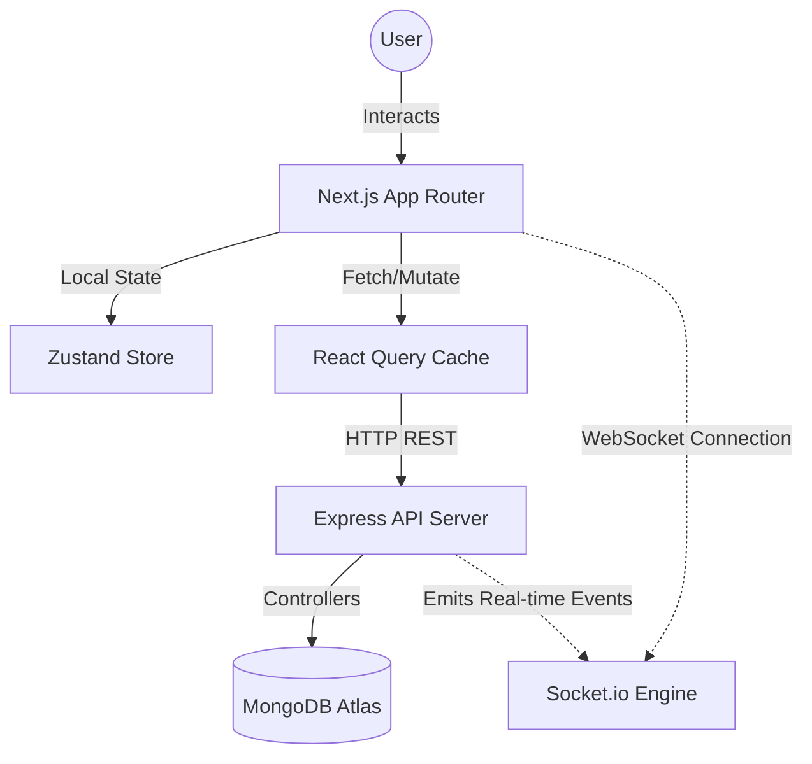

# 🚀 CodeAlpha_Projcet-Management-Tool

**🟢 Live Demo:** [https://code-alpha-projcet-management-tool-eight.vercel.app](https://code-alpha-projcet-management-tool-eight.vercel.app)

A full-stack, highly interactive Project Management Tool designed for modern teams. Built with a focus on speed, aesthetics, and real-time collaboration. The architecture is split into a **Next.js Frontend (Client)** and an **Express Backend (Server)**, providing a seamless, desktop-like experience on the web.

---

## 🌟 Key Features & Innovations

### 1. 🧭 Global Smart Navigation
- **Context-Aware Routing:** Utilizing Next.js `usePathname()` hook, the global Back Button dynamically tracks the user's location across the app.
- **Strict History Handling:** Invokes `router.back()` to seamlessly revert to the previous state without unnecessary re-renders or data fetching, acting globally except on the root Dashboard.

### 2. 📋 Advanced Kanban Project Boards
- **Drag-and-Drop Mastery:** Extremely fluid column and task reordering using `@dnd-kit/core`, supporting complex drag states and visual feedback.
- **Deep Task Architecture:** Tasks are not just titles—they support rich descriptions, priorities (Low to Urgent), multiple assignees, subtasks, checklists, file attachments, and precise time tracking logs.

### 3. 📅 Comprehensive Task Aggregation
- **Centralized "My Tasks" Engine:** Hits a specialized `GET /api/tasks/me` endpoint to aggregate cross-project assignments. 
- **Time-Based Filtering:** Uses JavaScript `Date` objects to accurately filter tasks into "All", "Today", and "Upcoming" buckets.
- **Dynamic Calendar View:** A custom-built, responsive monthly grid built with `date-fns`. It maps incoming task `dueDate` properties to a fully padded 7-day calendar grid, visualizing upcoming deadlines using project-specific color coding.

### 4. 🔔 Real-time Notification Engine & Sockets
- **Socket.io Integration:** True real-time collaboration. When a user drags a task to a new column or adds a comment, every connected workspace member sees the update instantly without page reloads.
- **Smart Routing & Mutations:** Automatically routes users to the exact project upon clicking a notification. Integrates `react-query` mutations (`PATCH /api/notifications/:id/read`) to handle optimistic UI updates instantly.

### 5. ⚙️ Deep Customization & Unified Settings
- **Unified Profile Management:** Consolidates public profile details and security settings into a singular, tabbed interface using `PATCH` endpoints for granular updates.
- **Native Theming:** Full support for System, Light, and Dark modes using Tailwind CSS and `next-themes`, ensuring zero UI flickering on load. Includes sleek, glassmorphism-inspired UI components.

---

## 🔒 Security & Technical Excellence

- **Secure Authentication:** JWT-based authentication flow with HTTP-only cookies (or secure headers) to prevent XSS attacks.
- **Role-Based Access Control (RBAC):** Granular permissions ensuring users can only access projects they belong to, and only admins can perform destructive actions.
- **Input Validation:** Strict payload validation using TypeScript and backend middleware to prevent NoSQL injection and ensure data integrity.
- **Optimized Performance:** `React Query` handles server-state with aggressive caching and background revalidation, reducing unnecessary API calls and server load.
- **Global Error Handling:** Centralized Express error-handling middleware catches API failures gracefully, returning standardized JSON responses.

---

## 🛠️ Technology Stack

### Frontend (Client)
- **Framework:** Next.js 14+ (App Router)
- **Language:** TypeScript
- **Styling:** Tailwind CSS, `framer-motion` for micro-animations
- **State Management:** Zustand (Global UI State) + TanStack React Query (Server State)
- **Components:** Radix UI primitives, `lucide-react` icons
- **Drag & Drop:** `@dnd-kit`

### Backend (Server)
- **Framework:** Node.js + Express
- **Language:** TypeScript
- **Database:** MongoDB + Mongoose ORM
- **Authentication:** JSON Web Tokens (JWT) + bcryptjs
- **Real-time Engine:** Socket.io

---

## 🏗️ Technical Architecture


- **Client Layer:** Next.js Server & Client Components delivering a highly responsive UI with `Zustand` managing ephemeral state.
- **Data & Caching:** `React Query` acts as the intermediary, fetching REST data from the server and aggressively caching it.
- **Server Layer:** Express REST API handles authentication (JWT), routing, and business logic before hitting the database.
- **Real-time Sync:** `Socket.io` runs parallel to HTTP. Whenever the API modifies data (e.g., task moved), it triggers an event to the Socket engine, which broadcasts changes back to all active clients instantly.

Follow these steps to run the application locally on your machine.

### 1. Prerequisites
- Node.js (v18 or higher)
- MongoDB running locally or a MongoDB Atlas URI

### 2. Install Dependencies
Open two separate terminals, one for the client and one for the server.

```bash
# Terminal 1 (Frontend)
cd client
npm install

# Terminal 2 (Backend)
cd server
npm install
```

### 3. Environment Variables
Create `.env` files in both `client` and `server` directories.

**In `/server/.env`**:
```env
PORT=5000
MONGODB_URI=mongodb://localhost:27017/pm_tool
JWT_SECRET=your_super_secret_jwt_key
JWT_EXPIRE=30d
NODE_ENV=development
```

**In `/client/.env.local`**:
```env
NEXT_PUBLIC_API_URL=http://localhost:5000/api
NEXT_PUBLIC_SOCKET_URL=http://localhost:5000
```

### 4. Run the Development Servers

```bash
# Terminal 1 (Frontend)
cd client
npm run dev
# The client will run on http://localhost:3000

# Terminal 2 (Backend)
cd server
npm run dev
# The server will run on http://localhost:5000
```
